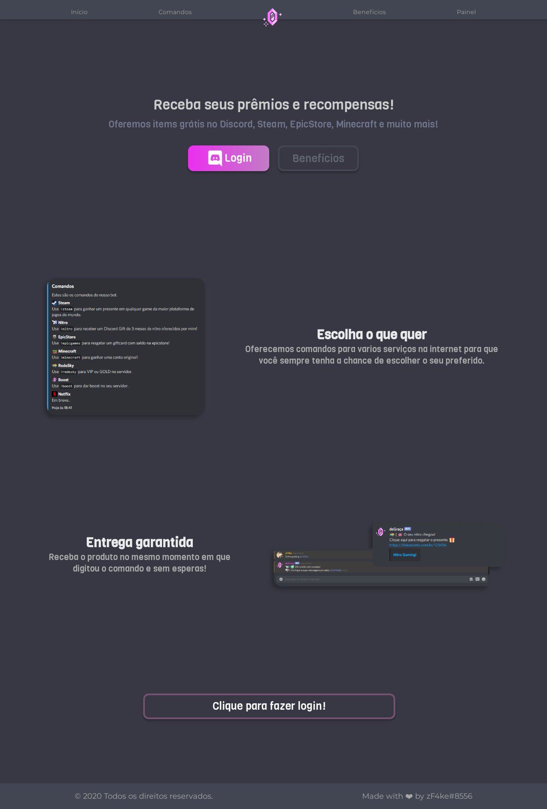

[![Contributors][contributors-shield]][contributors-url]
[![Forks][forks-shield]][forks-url]
[![Stargazers][stars-shield]][stars-url]
[![Issues][issues-shield]][issues-url]
[![MIT License][license-shield]][license-url]

 

  

  <h3 align="center">deGracaOAuth2</h3>
  
Site com integração do Discord OAuth2

  

## Contacto

Discord: zF4ke#8556
 
Email: pedrohsilva955gmail.com

## Licença

Distributed under the GNU General Public License v3.0. See `LICENSE` for more information.

[contributors-shield]: https://img.shields.io/github/contributors/zF4ke/deGracaOAuth2.svg?style=flat-square
[contributors-url]: https://github.com/zF4ke/deGracaOAuth2/graphs/contributors
[forks-shield]: https://img.shields.io/github/forks/zF4ke/deGracaOAuth2.svg?style=flat-square
[forks-url]: https://github.com/zF4ke/deGracaOAuth2/network/members
[stars-shield]: https://img.shields.io/github/stars/zF4ke/deGracaOAuth2.svg?style=flat-square
[stars-url]: https://github.com/zF4ke/deGracaOAuth2/stargazers
[issues-shield]: https://img.shields.io/github/issues/zF4ke/deGracaOAuth2.svg?style=flat-square
[issues-url]: https://github.com/zF4ke/deGracaOAuth2/issues
[license-shield]: https://img.shields.io/github/license/zF4ke/deGracaOAuth2.svg?style=flat-square
[license-url]: https://github.com/zF4ke/deGracaOAuth2/blob/master/LICENSE
